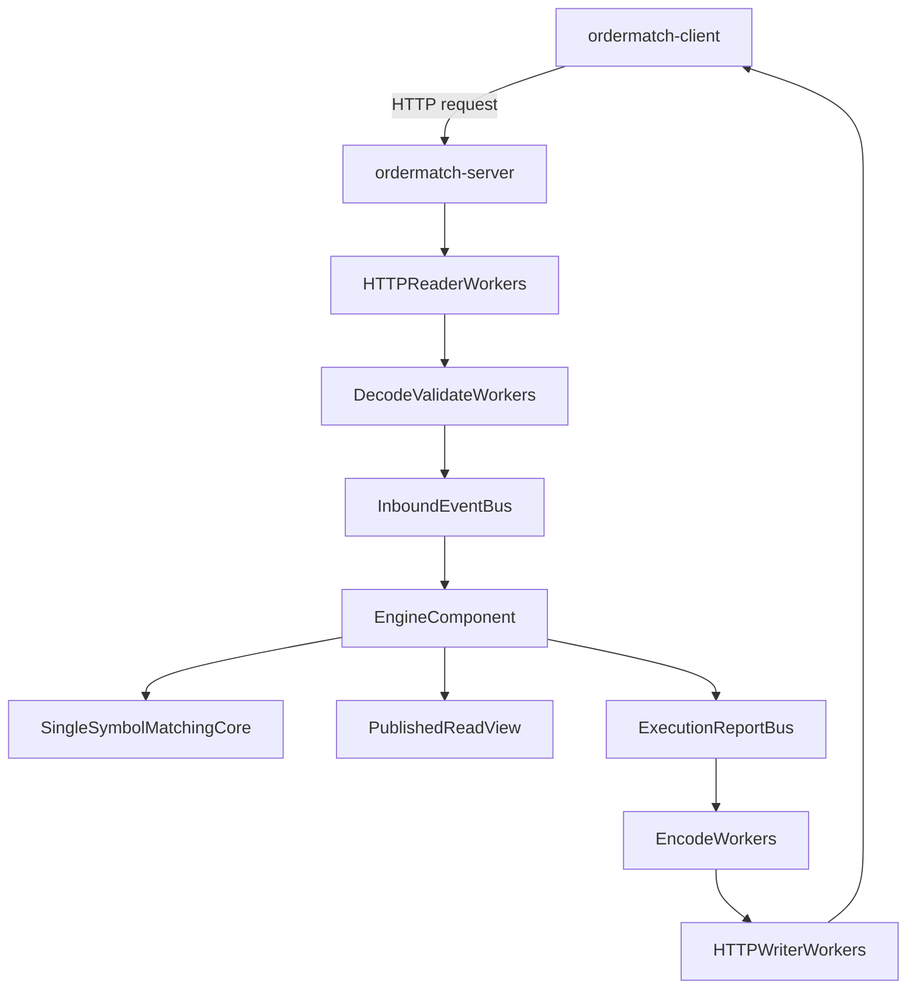
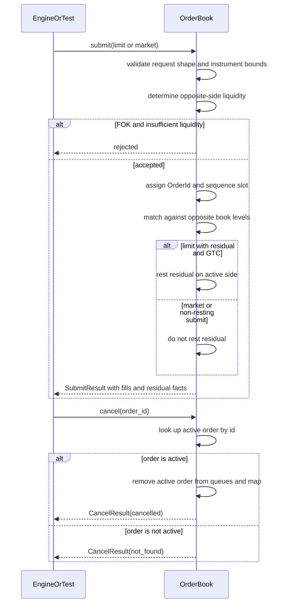

# OrderMatch Core Architecture

OrderMatch is a research-grade C++20 exchange matching prototype. The first version is intentionally narrow: one symbol, one deterministic matching core, and a REST client/server boundary built around compact event queues.

The main design assumption is that the matching core is not the dominant cost. For a minimal single-symbol book, matching should be a small cache-resident operation over compact price levels and order data. The expensive path is expected to be HTTP I/O, text parsing, JSON decode/encode, response construction, and memory movement around large request and response blobs.

## Goals

- Keep the matching core deterministic, small, and free of HTTP/JSON dependencies.
- Use unsigned integer domain types for prices, quantities, ids, and flag values.
- Avoid synchronous calls from HTTP workers into the engine.
- Convert REST/JSON input into compact typed events as early as possible.
- Process mutable order book state in one serialized engine component.
- Scale the transport boundary first: readers, deserializers, encoders, and writers.
- Preserve a clean future path for benchmarks, replay, and ML integration.

## Non-Goals For V1

- Multi-symbol matching.
- Engine-level sharding.
- Persistence.
- Authentication beyond an optional lightweight request-binding header.
- TLS.
- Full user accounts, balances, custody, or settlement.
- Risk checks.
- Advanced order types.
- Full exchange protocol compatibility.

## High-Level Flow



Request path:

1. HTTP reader worker receives bytes and performs HTTP framing.
2. Decode/validate worker parses JSON once.
3. External decimal values are mapped to internal integer ticks and units.
4. A compact inbound event is written to the inbound event bus.
5. The engine component drains inbound events synchronously.
6. The engine either calls the matching core or answers the event from engine-owned state.
7. An execution report is published.
8. Encode worker converts the report to JSON/HTTP.
9. HTTP writer worker sends the response.

## Core Boundary

The matching core must not know about:

- HTTP.
- JSON.
- Socket sessions.
- Request buffers.
- String symbols.
- Users or accounts.
- Transport errors.

The core should operate on compact domain types:

```cpp
using PriceTicks = std::uint32_t;
using QuantityUnits = std::uint32_t;
using OrderId = std::uint64_t;
using RequestId = std::uint64_t;
using SequenceNumber = std::uint64_t;
using OrderFlags = std::uint8_t;

using EventFlags = std::uint8_t;
using EventType = std::uint8_t;
```

Prices and quantities should never be represented as floating point inside the engine. Decimal input belongs to the transport decode layer and should be converted before an event reaches the inbound bus.

Prices and quantities are non-negative values, so v1 should use unsigned integer storage. A `std::uint32_t` baseline keeps event payloads small and allows price and quantity to be packed into one 64-bit word when useful:

```cpp
using PriceQuantity = std::uint64_t;

constexpr PriceQuantity pack_price_quantity(PriceTicks price, QuantityUnits quantity) noexcept {
    return (static_cast<PriceQuantity>(price) << 32) | quantity;
}

constexpr PriceTicks unpack_price(PriceQuantity value) noexcept {
    return static_cast<PriceTicks>(value >> 32);
}

constexpr QuantityUnits unpack_quantity(PriceQuantity value) noexcept {
    return static_cast<QuantityUnits>(value);
}
```

This also gives the decode layer one explicit place to reject values that exceed the configured tick or unit range before they reach the engine.

Core active orders should stay as small as possible. User identity, account identity, and ownership metadata do not belong in the matching-core order object. The engine can associate an `OrderId` with user/account metadata outside the core when a future authenticated transport exists. At the core level, `OrderId` is enough identity to cancel, match, and report active liquidity.

Resting-order side and any other order attributes that must survive submission should be stored as a compact bitmap, not as several independent enum fields:

```cpp
namespace order_flags {
constexpr OrderFlags side_sell = 1u << 0; // unset means buy
}
```

The concrete book storage can still evolve after measurement. If a standalone flags byte introduces padding in an array-of-structs layout, the book can move to struct-of-arrays storage or pack metadata beside price-level nodes without changing the domain contract.

## Instrument Configuration

V1 remains a single-symbol system, but the single instrument should be explicit. The engine owns one `InstrumentConfig` that defines the decimal mapping and valid ranges used before requests reach the matching core:

```cpp
struct InstrumentConfig {
    PriceTicks min_price;
    PriceTicks max_price;
    QuantityUnits min_quantity;
    QuantityUnits max_quantity;
    std::uint32_t price_scale;
    std::uint32_t quantity_scale;
};
```

This keeps the single-symbol assumption narrow without making tick size, lot size, and bounds implicit constants hidden in the HTTP codec.

Event metadata should be stored as compact bit fields rather than several independent enum members:

```cpp
namespace event_flags {
constexpr EventFlags side_sell = 1u << 0;      // unset means buy
constexpr EventFlags kind_market = 1u << 1;    // unset means limit
constexpr EventFlags tif_ioc = 1u << 2;
constexpr EventFlags tif_fok = 1u << 3;
}
```

The exact bit assignments should live in one header and be treated as part of the internal binary event contract.

## Order Lifecycle

The engine assigns accepted order ids. `RequestId` is only a transport correlation value; it does not identify a resting order and it does not imply ownership. `OrderId` is the stable engine identity used by the core and by cancel requests.

Submit lifecycle:

1. Transport receives a request and assigns or accepts a `RequestId`.
2. Decode and domain mapping validate shape, decimals, flags, and instrument ranges.
3. The engine accepts or rejects the submit.
4. Accepted submits receive an engine `OrderId`.
5. Rejected submits do not mutate book state.

Cancel lifecycle:

1. Transport maps `DELETE /orders/{id}` to a cancel event carrying the target `OrderId`.
2. The matching core cancels only if the target order is currently active in the book.
3. If the order is not active, the core returns `not_found` and does not distinguish whether it was filled, cancelled, expired, or never existed.

Thin client identity is allowed at the transport/engine boundary through an opaque uid returned by `POST /register`. Future user/account ownership belongs in an engine-side order registry keyed by `OrderId`, not in core `Order`. See `accounting.md`.

## Event Buses

The queue boundary between HTTP workers and the engine should be explicit and typed.

```cpp
struct InboundEvent {
    RequestId request_id;
    EventType type;
    EventFlags flags;
    PriceQuantity price_quantity;
    OrderId order_id;
};
```

This is a sketch, not the final ABI. The final layout should be chosen with cache behavior in mind:

- Fixed-width integers.
- A single compact flags byte for side, order kind, and related boolean order metadata.
- Packed price/quantity where it improves layout and queue movement.
- No heap ownership.
- No strings.
- No JSON objects.
- No HTTP request objects.
- Minimal routing metadata needed to complete the response.

The inbound bus is FIFO. Engine mutation order is the order in which the serialized engine runner drains accepted inbound events. If the inbound bus is full, the server returns an overload response before the event enters the engine; overload must not create partial engine state.

Outbound responses should be modeled as execution reports, not as a single flat price/quantity record. One accepted submit can create zero, one, or many fills, plus a residual resting quantity. The report header carries request correlation, order identity, cumulative quantity, leaves quantity, result code, and final sequence. Fill records carry maker/taker ids, price, quantity, and sequence. The storage strategy for variable fill lists can be optimized later with inline buffers, arenas, or pooled records, but the conceptual contract must represent multi-fill outcomes exactly.

## Decode And Encode Mapping

REST decoding should be centralized in a small transport codec layer. The codec is responsible for converting external JSON fields into internal event fields:

- Decimal price to `PriceTicks`.
- Decimal quantity to `QuantityUnits`.
- Side, order kind, and time-in-force strings to `EventFlags`.
- REST operation to `EventType`.
- Validation failures to compact transport error codes.

Validation is split by ownership:

- The HTTP codec validates request shape, HTTP method/target, required fields, and malformed JSON/decimals.
- The domain mapper applies `InstrumentConfig` to convert decimals into ticks/units and rejects out-of-range values.
- The engine/core validates trading rules, such as market orders not resting, FOK/IOC behavior, cancel target existence, and rejected input not mutating book state.

The reverse mapping should also be centralized for execution reports and read views:

- Internal result code to HTTP status.
- `PriceTicks` and `QuantityUnits` back to stable decimal strings.
- Packed trade data to compact JSON response objects.
- Engine sequence or read-view version to response metadata when needed.

This keeps encode/decode behavior transparent and testable while leaving room for later replacement with specialized kernels. If parsing or formatting becomes the bottleneck, the public mapping contract can stay stable while the implementation becomes more specialized.

The inbound and outbound buses should be bounded. If the inbound bus is full, the server should apply backpressure or return a clear overload response instead of growing memory without limit.

## Engine Component

The engine component owns the mutable state boundary:

- It drains inbound events.
- It calls the matching core for order-mutating events.
- It assigns accepted order ids.
- It keeps any future user/account ownership metadata outside the matching core.
- It handles engine-owned read operations where needed.
- It publishes execution reports.
- It owns the live `BookView` and publishes bounded read copies for selected read-only HTTP paths.

The matching core underneath that engine is limited to active-liquidity state, price-time matching, cancellation of active orders, and compact snapshots of active levels.

The engine is synchronous internally by design. This keeps order mutation deterministic and avoids locks inside the order book.

## Matching Core

V1 matching should support:

- Limit orders.
- Market orders.
- Cancel orders for active liquidity only.
- Price-time priority.
- FIFO within the same price level.
- Compact book snapshots of active liquidity.

Core invariants:

- The book must not remain crossed after matching.
- A fill must never exceed the incoming or resting remaining quantity.
- Better prices must match before worse prices.
- Earlier orders at the same price must match before later orders.
- Market orders must never rest.
- Rejected input must not mutate book state.
- Absence from the active-order map means the core does not own terminal lifecycle history for that order.

## Core Call Sequence

The synchronous core path should stay simple and explicit. For V1, the working order flow is:



Practical rules for the current core API:

- `submit()` is the only entry point for market and limit order processing.
- Market orders may match, but they never rest.
- Limit GTC orders may match and then rest any residual quantity.
- Limit IOC orders may match, but they never rest residual quantity.
- Limit FOK orders either fully match or reject before state mutation.
- `cancel()` only targets active resting liquidity already in the book.

## Read-Only And Fast Paths

Not all REST requests need to touch the matching core.

`GET /health` should be answered by the transport/server layer using atomics and worker status. It should not enter the engine queue.

Read-only book queries have two acceptable paths:

- Go through the engine component when strict freshness is required.
- Read from an engine-published snapshot when bounded staleness is acceptable.

For v1, prefer an engine-owned `BookView` for `GET /book`. HTTP handlers should request a bounded independent copy from the view, for example `book_view.bake(depth)`, and move that copy to the encoder/writer. `depth` is required to avoid fetching the complete book on every request. The baked view carries a `sequence` so clients and tests can reason about freshness.

`GET /book` should therefore have explicit depth semantics:

- Missing depth uses a small configured default.
- Depth `0` is invalid.
- Depth above the configured maximum is rejected.
- Each side returns at most `depth` aggregated price levels.

The depth view is an aggregated market-data view. It should expose price, total quantity, and optionally order count per level. It should not expose individual resting orders or user/account metadata.

## REST Surface

Initial REST API:

- `POST /register`: create a thin client uid for request attribution and local reconciliation.
- `POST /orders`: submit a limit or market order.
- `DELETE /orders/{id}`: cancel a resting order.
- `GET /book?depth=N`: retrieve a bounded compact depth view for the single symbol.
- `GET /health`: return server readiness and worker status.

The REST layer is an adapter. It should parse, validate, map, encode, and report transport-level errors. It should not own matching rules. The explicit API contract lives in `api.md`.

## Documentation Map

- `architecture.md`: core architecture, layering, and performance principles.
- `api.md`: REST endpoints, headers, result shapes, and HTTP status mapping.
- `accounting.md`: thin uid registration, request attribution, and client-side reconciliation.
- `blind_spots.md`: unresolved architecture decisions and conceptual risks.

## Dependency Policy

Dependencies should stay limited:

- Boost.Asio/Beast for sockets and HTTP.
- Boost.JSON for JSON parsing and encoding.
- GoogleTest for tests.

Boost and HTTP types should not appear in the matching core.

## Planned Targets

- `ordermatch_core`: static library for matching data structures and algorithms.
- `ordermatch_engine`: static library for event structs, event buses, engine runner, and read views.
- `ordermatch_http`: static library for HTTP parsing, routing, encoding, and pipeline helpers.
- `ordermatch_server`: REST server executable.
- `ordermatch_client`: CLI client executable.
- `ordermatch_tests`: GoogleTest suite.

## Planned Layout

```text
OrderMatch/
  CMakeLists.txt
  docs/
    architecture.md
    api.md
    accounting.md
    blind_spots.md
  include/
    order_match/
      core/
        types.hpp
        instrument.hpp
        order.hpp
        order_book.hpp
        matching_engine.hpp
      engine/
        event.hpp
        execution_report.hpp
        event_bus.hpp
        engine_runner.hpp
        read_view.hpp
      http/
        codec.hpp
  src/
    core/
      order_book.cpp
      matching_engine.cpp
    engine/
      engine_runner.cpp
    http/
      codec.cpp
    server/
      main.cpp
      http_server.hpp
      http_pipeline.hpp
      routes.hpp
    client/
      main.cpp
  tests/
    order_book_tests.cpp
    matching_engine_tests.cpp
  third_party/
    README.md
```

## Performance Principles

- Parse text once at the edge.
- Convert decimal input to integer domain types before queueing.
- Keep JSON and HTTP blobs outside the engine.
- Keep mutable order book ownership single-threaded.
- Prefer bounded queues over unbounded allocation.
- Avoid virtual dispatch in the hot path unless measurement proves it harmless.
- Keep response payloads compact and stable.
- Make the core directly callable for future replay, benchmark, and ML workflows.
